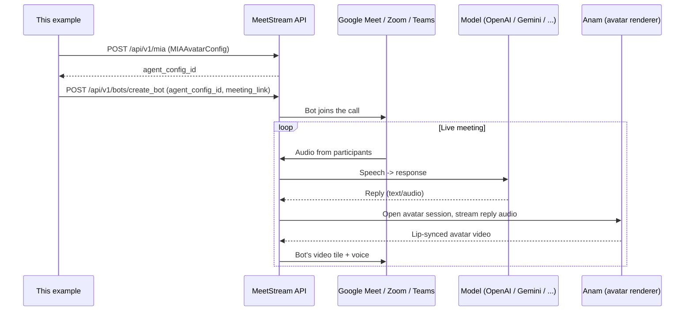

# MIA Avatar Agent

Give your MIA agent a photorealistic, animated face that lip-syncs to its voice in real time on the bot's video tile — right inside a live Google Meet, Zoom, or Microsoft Teams call.

MeetStream uses [Anam](https://anam.ai) as the avatar provider. Avatars work in both **realtime** and **pipeline** MIA modes, across all three supported meeting platforms.

This example is the runnable version of `MIAAvatarConfig`: it fetches a valid `avatar_id`, creates an avatar-enabled MIA agent, and deploys it into a real meeting.

> **This example uses no shared or preconfigured resources.** Every user supplies their own MeetStream API key and Anam avatar, and creates their own MIA agent (`agent_config_id`) on their own MeetStream account — see [Setup](#setup) below.

## Prerequisites

- [Node.js](https://nodejs.org/) 18 or newer (tested on Node 22)
- A MeetStream API key
- An [Anam](https://anam.ai) account with an API key
- Your Anam API key saved in the MeetStream dashboard under **Integrations → Avatar → Anam**

## How it works

This example communicates exclusively with the MeetStream API; it does not integrate with Anam directly to render media (the sole exception being `list-avatars`, a client-side convenience lookup). MeetStream is responsible for orchestrating the model, the meeting platform, and Anam on your behalf:



At a high level: `npm run create-agent` reads [`agent.config.json`](agent.config.json), attaches an `Avatar` block built from `ANAM_AVATAR_ID` and related `.env` values, and registers the result with MeetStream, which returns an `agent_config_id`. `npm run deploy` then instructs MeetStream to deploy a bot carrying that configuration into a specified meeting. From that point, MeetStream's backend manages the entire session: transcribing the meeting, running the configured model, and establishing a session with Anam to render the avatar's face onto the bot's video track. This repository's code never processes meeting audio or video directly — it only issues configuration and deployment requests to the MeetStream API.

## Setup

```bash
npm install
cp .env.example .env
```

On Windows `cmd.exe`, use `copy .env.example .env` instead (or `Copy-Item .env.example .env` in PowerShell).

Fill in `.env`:

| Variable | Description |
| --- | --- |
| `MEETSTREAM_API_KEY` | Your MeetStream API key |
| `ANAM_API_KEY` | Your Anam API key (also saved in MeetStream Integrations) |
| `ANAM_AVATAR_ID` | An Anam `avatar_id` — see [Finding your avatar_id](#finding-your-avatar_id) |
| `MEETING_LINK` | The Google Meet / Zoom / Teams link to join |
| `MIA_AGENT_CONFIG_ID` | Optional — set after `npm run create-agent`, or leave blank and `npm start` creates one for you |

### Configuring the agent

Every aspect of the agent itself — mode (`pipeline` or `realtime`), model provider, voice, transcriber, prompts, VAD tuning — is defined in [`agent.config.json`](agent.config.json), rather than through `.env` variables. This file is a standard [MIA agent config](https://docs.meetstream.ai/api-reference/api-endpoints/mia/create-agent-config) with the `Avatar` block omitted; `npm run create-agent` reads it as-is and attaches `Avatar` separately, using `ANAM_AVATAR_ID` from `.env`.

To change the agent, replace the contents of `agent.config.json` with any example from [MeetStream's reference documentation](https://docs.meetstream.ai/api-reference/api-endpoints/mia/create-agent-config?explorer=true) — Realtime or Pipeline, any supported model provider — minus its `Avatar` field. The example can be used as-is: no field mapping or translation is required, so the shape MeetStream's documentation shows for a given provider is exactly what gets sent. The included `agent.config.json` uses MeetStream's own Realtime + OpenAI example as a working default.

To maintain multiple configurations, set `MIA_AGENT_CONFIG_FILE` in `.env` to point at a different file for a given run (defaults to `./agent.config.json`).

Only the avatar itself is configured through `.env`: `ANAM_AVATAR_ID` (required), plus the optional `ANAM_AVATAR_PROVIDER`, `ANAM_AVATAR_MODEL`, and `ANAM_AVATAR_NAME` — see [`.env.example`](.env.example) for details.

### Finding your avatar_id

Anam accounts have both `persona_id`s and `avatar_id`s — both are UUIDs, but MeetStream needs the **avatar id** specifically. If you pass a persona id by mistake, MeetStream's error message tells you and shows how to fetch the correct one.

`GET /v1/avatars` (what `npm run list-avatars` calls) returns the full Anam avatar catalog available to your key — stock gallery avatars included, not just custom ones you've created. It's paginated (10 per page by default); this script only prints the first page, which is plenty to grab an id from:

```bash
npm run list-avatars
```

Copy an `id` from the output into `ANAM_AVATAR_ID`. To browse available avatars visually before choosing one, use the [Anam Avatar Gallery](https://anam.ai/docs/personas/avatars/gallery) instead — it draws from the same catalog, with image previews, and requires no `.env` setup.

## Usage

Run the complete flow — create your own avatar agent, if one does not already exist, and deploy it into `MEETING_LINK`:

```bash
npm start
```

Or run each step individually:

```bash
npm run create-agent   # creates a new MIA agent on YOUR MeetStream account, prints its agent_config_id
npm run deploy          # deploys MIA_AGENT_CONFIG_ID into MEETING_LINK
```

`npm run create-agent` creates a new agent every time it runs. Save the printed `agent_config_id` into `MIA_AGENT_CONFIG_ID` in `.env` to reuse the same agent on subsequent runs, rather than accumulating additional agents on your account.

When the bot joins, the avatar renders on the bot's participant tile and lip-syncs to every TTS response.

## MIAAvatarConfig reference

This is the `POST https://api.meetstream.ai/api/v1/mia` body sent when using the default [`agent.config.json`](agent.config.json) — MeetStream's own ["Realtime - Avatar (Anam)"](https://docs.meetstream.ai/api-reference/api-endpoints/mia/create-agent-config) reference example, with the `Avatar` block attached by [`createAvatarAgent.js`](src/createAvatarAgent.js):

```json
{
  "agent_name": "MIA Avatar Agent",
  "mode": "realtime",
  "model": {
    "provider": "openai",
    "model": "gpt-realtime-mini",
    "system_prompt": "You are a helpful AI meeting assistant. Keep responses concise and natural. Listen actively and provide value to the conversation.",
    "first_message": "Hey there! I am your AI assistant, ready to help with your meeting.",
    "temperature": 0.8,
    "voice": "coral",
    "modalities": ["text", "audio"],
    "max_response_output_tokens": 200
  },
  "voice": null,
  "transcriber": null,
  "agent": {
    "tools": [],
    "preemptive_generation": false,
    "user_away_timeout": 15,
    "interruptions": { "min_duration_seconds": 0.5, "word_threshold": 0 },
    "false_interruption_timeout": 2,
    "vad_type": "server_vad",
    "enable_interruptions": true,
    "resume_false_interruption": true,
    "tools_enabled": false,
    "vad_threshold": 0.5,
    "vad_prefix_padding_ms": 0,
    "vad_silence_duration_ms": 200
  },
  "audio": {
    "sample_rate": 24000,
    "num_channels": 1
  },
  "wake_word": null,
  "Avatar": {
    "provider": "anam",
    "enabled": true,
    "avatar_id": "f0e7a8c4-1234-4abc-9def-0123456789ab"
  }
}
```

> **Note the field casing:** MeetStream's reference shows the avatar block as a top-level, capitalized **`Avatar`** field, both in the request body and in every response payload — not `avatar`. This example follows that convention. (MeetStream's JSON parsing is case-insensitive on the way in, so a lowercase `avatar` key would also be accepted — but `Avatar` is what MeetStream's documentation and API responses use, so that is what this example sends.)

| Setting | Required | Description |
| --- | --- | --- |
| `Avatar.enabled` | No (default: `false`) | Whether the agent renders a video avatar |
| `Avatar.provider` | No (default: `anam`) | Avatar provider — currently `anam` only |
| `Avatar.avatar_id` | Yes (when enabled) | Anam `avatar_id` — see [Finding your avatar_id](#finding-your-avatar_id) |
| `Avatar.avatar_model` | No | Optional Anam `avatarModel` override |
| `Avatar.name` | No | Optional persona display name |

> The "Required: No" entries above describe the general API: omitting `Avatar.enabled` in a raw request causes it to default to `false` (no avatar). Since the purpose of this example is to enable an avatar, [`createAvatarAgent.js`](src/createAvatarAgent.js) always sets `enabled: true` explicitly; it is never omitted here.

## Troubleshooting

**The bot joins the meeting normally, `video_required: true` is set, and the agent config's `Avatar.enabled` is `true` with a valid `avatar_id` — but no avatar appears, and no error is reported:**

This is almost always caused by a **stale or incorrect Anam key saved in MeetStream Dashboard → Integrations → Avatar → Anam.** That dashboard key is what MeetStream's backend uses server-side to open the Anam avatar session during a live call — it is entirely separate from `ANAM_API_KEY` in your local `.env`, which is used only by this repository's `list-avatars` script.

Symptoms that indicate this specifically: `GET /api/v1/bots/{bot_id}` shows `InMeeting: true` and `Recording: true`, but `VideoProcessing` remains `false` indefinitely, with no timestamp and no error message — regardless of model provider or `avatar_id`. If the Anam key works correctly when called directly (`GET https://api.anam.ai/v1/avatars`, or by creating a session token via `POST https://api.anam.ai/v1/auth/session-token`), but avatars still do not render within a MeetStream call, re-save the current Anam key in the MeetStream dashboard integration and redeploy. This was confirmed to resolve the issue during development, after ruling out every other variable (model provider, `avatar_id`, agent configuration).

**Avatar does not appear, or the session fails to start (other causes):**

- **Wrong ID type** — MeetStream needs `avatar_id`, not `persona_id`. Obtain one from the [Anam Avatar Gallery](https://anam.ai/docs/personas/avatars/gallery), or via `GET https://api.anam.ai/v1/avatars` (`npm run list-avatars`).
- **Anam API key rejected (401/403)** — the `ANAM_API_KEY` stored under MeetStream Integrations was rotated or is invalid. Update it in the dashboard.
- **Concurrent session limit** — Anam caps concurrent sessions per account and has no kill-session API. Orphaned sessions auto-expire at `maxSessionLengthSeconds` (~180s default). MeetStream's error message lists the open sessions and their expiry ETA.

## Dependencies

- **Node.js 18+** (tested on Node 22) — uses native `fetch`, no HTTP client dependency
- **[`dotenv`](https://www.npmjs.com/package/dotenv) `^16.4.5`** — the only runtime dependency, loads `.env`; exact resolved version is pinned in `package-lock.json`

No other dependencies — the MeetStream/Anam API calls are plain `fetch` requests in [`src/http.js`](src/http.js).

## Files

```
mia-avatar-agent/
├── src/
│   ├── http.js                # tiny fetch wrapper + env helper
│   ├── listAnamAvatars.js     # GET https://api.anam.ai/v1/avatars
│   ├── createAvatarAgent.js   # reads agent.config.json, attaches Avatar, POST /api/v1/mia
│   ├── deployBot.js           # POST https://api.meetstream.ai/api/v1/bots/create_bot
│   └── index.js               # end-to-end: create agent (if needed) + deploy
├── agent.config.json          # the agent itself -- replace with any MeetStream reference example
├── .env.example
└── package.json
```
